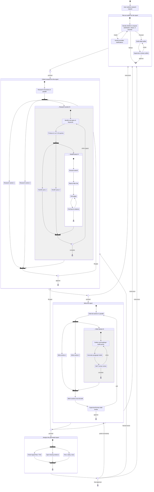

```mermaid
stateDiagram-v2
    %% ─────────────── ENTRY & HIGH‑LEVEL FLOW ───────────
    [*]
    UserRequest: User submits research request
    PlanOutline: Plan an outline for the report
    CollectResearch: Collect research for the report
    WriteReport: Write the report
    AnalyzeReport: Analyze the generated report

    state assessOutline <<choice>>
    state assessResearch <<choice>>
    state assessWriting <<choice>>
    state assessAnalysis <<choice>>

    [*] --> UserRequest
    UserRequest --> PlanOutline

    PlanOutline --> assessOutline
        assessOutline --> CollectResearch: proceed

    CollectResearch --> assessResearch
        assessResearch --> PlanOutline: restructure
        assessResearch --> WriteReport: proceed

    WriteReport --> assessWriting
        assessWriting --> PlanOutline: restructure
        assessWriting --> CollectResearch: fill gaps
        assessWriting --> AnalyzeReport: proceed

    AnalyzeReport --> assessAnalysis
        assessAnalysis --> PlanOutline: restructure
        assessAnalysis --> CollectResearch: factual issues
        assessAnalysis --> WriteReport: polish tone/clarity
        assessAnalysis --> [*]: final approval

    %% ──────────────────── PLAN OUTLINE ─────────────────
    state PlanOutline {
        [*]
        Decide: Decide whether to request clarification, refuse, or proceed
        HumanFeedback: Human provides clarifications
        GenerateOutline: Draft initial outline
        ReviewOutline: Supervisor reviews outline

        [*] --> Decide
        Decide --> HumanFeedback: Clarify
        Decide --> [*]: Refuse
        Decide --> GenerateOutline: Proceed
        HumanFeedback --> Decide
        GenerateOutline --> ReviewOutline
        ReviewOutline --> GenerateOutline: revise
        ReviewOutline --> [*]: approve
    }

    %% ────────────────── COLLECT RESEARCH ─────────────────
    state CollectResearch {
        [*]
        ResearchSectionsInParallel: Research all sections in parallel
        ResearchSection1: Research section 1
        ResearchSection2: Research section 2
        ...ResearchSectionN: ... Research section N
        state ForkResearch <<fork>>
        state JoinResearch <<join>>
        state ReviewResearch <<choice>>

        state ...ResearchSectionN {
            [*]
            PlanResearch: Identify sub‑topics & keywords
            GenerateQueries: Produce & run 5‑10 queries
            Query1: Handle query 1
            Query2: Handle query 2
            ...QueryN: ... Handle query N
            state ForkQueries <<fork>>
            state JoinQueries <<join>>
            state ReviewResearchAndDecide <<choice>>

            [*] --> PlanResearch
            PlanResearch --> GenerateQueries
            GenerateQueries --> ForkQueries
            ForkQueries --> Query1
            ForkQueries --> Query2
            state ...QueryN {
                [*]
                ExecuteQuery: Execute search
                RankAndFilterResults: Rank & filter hits
                OpenPages: Visit pages
                ExtractInsights: Pull facts & citations

                [*] --> ExecuteQuery
                ExecuteQuery --> RankAndFilterResults
                RankAndFilterResults --> OpenPages
                OpenPages --> ExtractInsights
                ExtractInsights --> OpenPages
                ExtractInsights --> [*]
            }
            ForkQueries --> ...QueryN
            Query1 --> JoinQueries
            Query2 --> JoinQueries
            ...QueryN --> JoinQueries
            JoinQueries --> ReviewResearchAndDecide
            ReviewResearchAndDecide --> PlanResearch: refine (gaps)
            ReviewResearchAndDecide --> [*]: complete
        }

        [*] --> ResearchSectionsInParallel
        ResearchSectionsInParallel --> ForkResearch
        ForkResearch --> ResearchSection1
        ForkResearch --> ResearchSection2
        ForkResearch --> ...ResearchSectionN
        ResearchSection1 --> JoinResearch
        ResearchSection2 --> JoinResearch
        ...ResearchSectionN --> JoinResearch
        JoinResearch --> ReviewResearch
        ReviewResearch --> ForkResearch: fill gaps
        ReviewResearch --> [*]: approve
    }

    %% ─────────────────── WRITE REPORT ───────────────────
    state WriteReport {
        [*]
        WriteSectionsInParallel: Draft all sections in parallel
        CombineSections: Stitch sections into full draft
        ReviewWriting: Supervisor/human draft review
        WriteSection1: Write section 1
        WriteSection2: Write section 2
        ...WriteSectionN: ... Write section N

        state ForkWrite <<fork>>
        state JoinWrite <<join>>
        [*] --> WriteSectionsInParallel
        WriteSectionsInParallel --> ForkWrite
        ForkWrite --> WriteSection1
        ForkWrite --> WriteSection2
        ForkWrite --> ...WriteSectionN

        state ...WriteSectionN {
            [*]
            BuildSectionTemplate: Outline sub‑headings / bullet points
            WriteContents: Generate paragraph drafts
            ReviewSectionWriting: Self / human review

            [*] --> BuildSectionTemplate
            BuildSectionTemplate --> WriteContents
            WriteContents --> ReviewSectionWriting
            ReviewSectionWriting --> BuildSectionTemplate: refine
            ReviewSectionWriting --> [*]: complete
        }

        WriteSection1 --> JoinWrite
        WriteSection2 --> JoinWrite
        ...WriteSectionN --> JoinWrite
        JoinWrite --> CombineSections
        CombineSections --> ReviewWriting
        ReviewWriting --> WriteSectionsInParallel: edit
        ReviewWriting --> [*]: approve
    }

    %% ─────────────────── ANALYZE REPORT ─────────────────
    state AnalyzeReport {
        [*]
        CritiqueStructure: Check logical flow / TOC
        IdentifyResearchGaps: Spot missing evidence
        AssessWritingStyle: Tone, clarity, voice

        state finalizeFork <<fork>>
        state finalizeJoin <<join>>

        [*] --> finalizeFork
        finalizeFork --> CritiqueStructure
        finalizeFork --> IdentifyResearchGaps
        finalizeFork --> AssessWritingStyle

        CritiqueStructure --> finalizeJoin
        IdentifyResearchGaps--> finalizeJoin
        AssessWritingStyle  --> finalizeJoin
        finalizeJoin --> [*]
    }
```
